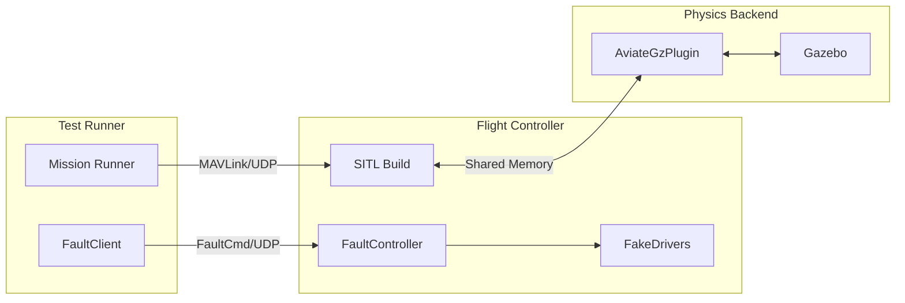

# Aviate Test Specification & DO-178C Compliance Strategy

**Testing, Verification, and Compliance Standards for Aviate Core**

---

## 0. Document Status

| Version | Date | Status |
|---------|------|--------|
| v0.1 | 2025-11-28 | Initial Draft based on DO-178C objectives |

**Related Documents**:
- `AVIATE_SPEC.md` — Architecture & Requirements
- `AVIATE_LANGUAGE_PROFILE.md` — Coding Standards

---

## 1. Compliance Strategy (DO-178C)

The Aviate project targets software assurance levels equivalent to **DO-178C Level A/B** (Catastrophic/Hazardous failure conditions). While full certification is a formal process involving designated engineering representatives, this specification defines the technical artifacts and processes required to support such certification.

### 1.1 Core Objectives
1.  **Requirements-Based Testing**: All code must be traceable to requirements in `AVIATE_SPEC.md`.
2.  **Structural Coverage**: 100% Statement, Branch, and MC/DC coverage for critical components.
3.  **Robustness**: Verification of behavior under abnormal inputs and failure conditions.
4.  **Independence**: Verification activities performed by engineers independent of the design implementation where possible.

---

## 2. Static Analysis & Security Testing (SAST)

Static analysis is the first line of defense, enforcing the `AVIATE_LANGUAGE_PROFILE.md` and identifying latent defects without execution.

### 2.1 Static Analysis Tools
The following toolchain is mandatory for all builds:
-   **`rustc` (Compiler Checks)**: Enforces memory safety (borrow checker), type safety, and lifetime correctness.
    -   *Config*: `deny(warnings)`, `forbid(unsafe_code)`.
-   **`clippy` (Linter)**: Advanced static analysis for common mistakes, performance issues, and style.
    -   *Mandatory Lints*: See `tests/lint-verification/src/lib.rs`.
    -   *Security Lints*: Integration with `clippy::pedantic` and `clippy::nursery` selectively to match CWE guidelines.
-   **`cargo-audit`**: Checks `Cargo.lock` against the RustSec Advisory Database for vulnerable dependencies (though dependencies are minimized).

### 2.2 Control Flow & Data Flow Analysis
-   **Control Flow Analysis**:
    -   The Rust compiler acts as a rigorous control flow analyzer. The `#[deny(unreachable_code)]` and `#[deny(unused_must_use)]` attributes ensure all code paths are valid and all results are handled.
    -   Cyclomatic complexity is monitored; functions exceeding complexity thresholds must be refactored.
-   **Data Flow Analysis**:
    -   Rust's ownership model provides build-time data flow analysis, preventing use-after-free, uninitialized memory access, and data races.
    -   **Taint Analysis**: For critical inputs, we use the Type System (Newtypes) to prevent "tainted" raw scalars from mixing with "sanitized" physical quantities. (e.g., raw `f32` cannot be assigned to `Meters` without validation).
-   **Security Standards**:
    -   Adherence to **CWE** (Common Weakness Enumeration) top 25 via memory safety guarantees.
    -   Adherence to **CERT C/C++** equivalent rules for Rust (e.g., integer overflow protection via `checked_` math or strict panic-free policies).

---

## 3. Reviews & Walkthroughs

Automated tools are augmented by human review to ensure semantic correctness and design adherence.

### 3.1 Code Review Process
-   **Pull Request Gates**: No code enters `main` without passing CI (Static + Dynamic analysis).
-   **Peer Review**: Mandatory approval from at least one maintainer.
-   **Checklist**:
    -   [ ] Traceability: Does this change map to a specific Requirement or Bug ID?
    -   [ ] Safety: Are all math operations safe (no potential for panic)?
    -   [ ] Complexity: Is the logic readable and verifiable?
    -   [ ] Tests: Are requirements-based tests included?

### 3.2 Inspections
-   **Safety Reviews**: Focused inspections on the Fault Handling Table (`fault.rs`) and Sanitization Logic (`mixer.rs`).
-   **Walkthroughs**: Periodic team walkthroughs of complex algorithms (e.g., EKF, Control Allocation) to verify logic flow against the `AVIATE_SPEC.md`.

---

## 4. Dynamic Analysis & Testing

Our testing framework supports Unit, Integration, and System/SITL testing.

### 4.1 Unit Testing
*Objective: Verify individual components in isolation.*
-   **Location**: `#[test]` modules within source files (or `tests/` for public API).
-   **Methodology**:
    -   **Isolation**: Use of mocks/stubs is minimized; prefer pure functions that are easily tested.
    -   **Boundary Analysis**: Tests must cover min/max values, zero, and slightly out-of-bound values.
    -   **Fault Injection**: Verify component behavior when dependent data is marked `invalid` or `Source::Fault`.

### 4.2 Automated Test Case Generation (Fuzzing & Property Testing)
To cover edge cases that manual tests miss:
-   **Property-Based Testing (`proptest` / `quickcheck`)**:
    -   Generates thousands of random inputs to verify properties (e.g., `sanitize(input)` never returns `NaN`).
    -   *Goal*: Prove invariants hold for *all* `f32` inputs.
-   **Fuzzing (`cargo-fuzz`)**:
    -   Directed fuzzing of parsers (Mavlink, Config) and sanitizers to find panics or crashes.

### 4.3 Integration Testing
*Objective: Verify interaction between components (e.g., EKF -> Control -> Mixer).*
-   **Location**: `tests/` directory.
-   **Scenarios**:
    -   Full control loop stepping with synthetic sensor data.
    -   Mode transition sequences (Hover -> Cruise -> Hover).

### 4.4 Structural Code Coverage
We aim for **100% MC/DC (Modified Condition/Decision Coverage)** on the kernel core.
-   **Tools**: `cargo-tarpaulin` or `llvm-cov`.
-   **Metrics**:
    -   **Statement Coverage**: All lines executed.
    -   **Branch Coverage**: All `if/else` and `match` arms taken.
    -   **MC/DC**: Critical for Level A. For complex boolean expressions, test cases must demonstrate independence of conditions.

---

## 5. Traceability

**Bidirectional Traceability** is required between Requirements, Code, and Tests.

-   **Requirements ID**: Defined in `AVIATE_SPEC.md` (implied by section structure, e.g., `REQ-SPEC-9.2`).
-   **Code tagging**: Critical functions should reference requirements.
-   **Test tagging**: Test function names or comments should reference the requirement they verify.
    -   Example: `fn test_req_9_2_actuator_coupling_fallback() { ... }`

---

## 6. Compliance Reporting

Automated generation of compliance artifacts for every release.

-   **Test Results Report**: Pass/Fail status of all test cases.
-   **Coverage Report**: Heatmap of code coverage, highlighting uncovered branches.
-   **Static Analysis Report**: Output of `clippy` and `rustc` confirming zero violations.
-   **Traceability Matrix**: (Future work) Automated tool to map Requirements <-> Tests.

---

## 7. CI/CD Integration

The Continuous Integration pipeline enforces the compliance strategy.

### Pipeline Stages:
1.  **Format & Lint**: `cargo fmt --check`, `cargo clippy -- -D warnings`.
2.  **Unit Test**: `cargo test --lib`.
3.  **Integration Test**: `cargo test --tests`.
4.  **Doc Test**: `cargo test --doc`.
5.  **Coverage**: Run coverage tool and fail if threshold < 90% (aiming for 100%).
6.  **Build Verification**: Compile for target hardware (thumbv7em/thumbv8m) to ensure `no_std` compliance.

---

## 8. Tool Qualification

For DO-178C, tools used for verification must be qualified if their output is relied upon without further verification.
-   **Compiler (`rustc`)**: Verification relies on object code inspection or adequate testing of the executable (end-to-end testing).
-   **Test Runner**: The test framework itself is verified by running a "self-test" suite.
-   **Qualification Kits**: Future procurement of qualification kits for Rust toolchains (e.g., Ferrocene) is the path to certified flight.

---

## 9. XIL (X-In-Loop) Fault Injection Testing

SITL (Software-In-The-Loop) and HITL (Hardware-In-The-Loop) testing with deterministic fault injection for robustness verification.

### 9.1 Architecture



**Data Flow:**
```
Mission Runner                Flight Controller              Gazebo
     │                              │                           │
     │── MAVLink (arm/thrust) ─────>│                           │
     │                              │<── HIL_SENSOR/HIL_GPS ────│
     │── FaultCmd (inject) ────────>│                           │
     │<── FaultAck ─────────────────│                           │
     │                              │── Motor Commands ────────>│
```

**Key Components:**
-   **FaultClient** (`aviate-hal-xil`): Test runner sends fault injection commands via UDP
-   **FaultController** (`aviate-hal-xil`): FC receives and applies faults to FakeDrivers
-   **FakeDriver** (`aviate-hal-io`): Simulated sensors with fault injection capability

### 9.2 Port Allocation

**Scheme:** `base_port + instance * stride + slot`

| Parameter | Default | Description |
|-----------|---------|-------------|
| base_port | 20000 | Base port for instance 0 |
| stride | 16 | Ports per instance |

**Port Slots (per instance):**

| Slot | Offset | Purpose |
|------|--------|---------|
| SensorIn | +0 | Simulator → FC (HIL_SENSOR/HIL_GPS) |
| ActuatorOut | +1 | FC → Simulator (motor commands) |
| FaultCmd | +2 | Test → FC (fault injection) |
| XilCtrl | +3 | Pause/step/reset/time sync |
| TestTelemetry | +4 | FC → Test (EKF quality) |
| TraceProfile | +5 | Profiling data |
| Payload0-3 | +6..+9 | Cameras, lidar, etc. |

**Example (2-vehicle simulation):**
-   Vehicle 0: ports 20000-20015
-   Vehicle 1: ports 20016-20031

**GCS Compatibility:**
-   GCS port **14550** (QGroundControl default) is preserved for telemetry

**Environment Variables:**
```bash
XIL_BASE_PORT=20000    # Override base port
XIL_PORT_STRIDE=16     # Override stride (minimum 16)
```

### 9.3 Fault Types

Faults are injected at the FakeDriver layer, independent of physics backend:

| Fault | Effect | Applicable Sensors |
|-------|--------|-------------------|
| `HealthDegraded` | Sets sensor health to Degraded | All |
| `HealthFailed` | Sets sensor health to Failed | All |
| `NaN` | Injects NaN values | All |
| `Dropout { cycles }` | Drops readings for N cycles | All |
| `BiasShift { offset[3] }` | Adds 3-axis offset | IMU, Mag, GNSS |
| `BiasScalar { offset }` | Adds scalar offset | Baro |

### 9.4 Fault Injection Protocol

**FaultCommand (12 bytes, UDP):**
```
magic: u16 = 0xFA17
sequence: u16
target: u8 (0=IMU, 1=Baro, 2=Mag, 3=GNSS, 255=All)
action: u8 (0=Clear, 1=Degraded, 2=Failed, 3=NaN, 4=Dropout, 5=BiasShift, 6=BiasScalar)
param1-3: i16 × 3 (fault-specific parameters)
```

**FaultAck (8 bytes, UDP):**
```
magic: u16 = 0xAC17
sequence: u16
status: u8 (0=Ok, 1=UnknownTarget, 2=UnknownAction, 3=InvalidParams, 4=NotEnabled)
target: u8
reserved: u16
```

### 9.5 Test Configuration Format

Fault injection phases in TOML:

```toml
[[vehicles.mission.phases]]
name = "inject_imu_fault"
duration_ms = 100
action = { type = "inject_fault", sensor = "imu", fault = "degraded" }

[[vehicles.mission.phases]]
name = "fly_with_degraded_imu"
duration_ms = 5000
action = { type = "thrust", value = 0.7 }
verify = [{ type = "max_drift", value = 5.0 }]

[[vehicles.mission.phases]]
name = "clear_faults"
duration_ms = 100
action = { type = "clear_faults" }
```

### 9.6 Feature Flag

Fault injection is gated by the `xil-fault` feature:

```toml
# aviate-hal-io/Cargo.toml
[features]
xil-fault = []  # Enables SensorFault API

# aviate-hal-xil/Cargo.toml
[features]
xil-fault = ["aviate-hal-io/xil-fault"]  # Enables FaultController
```

Production builds exclude fault injection code entirely.

### 9.7 Determinism & Reproducibility

SITL tests are deterministic when:
1. **Lockstep simulation**: Gazebo physics synchronized with FC control loop
2. **Fixed random seeds**: Sensor noise uses deterministic PRNG
3. **Logged fault sequences**: `(sim_time, FaultCommand)` pairs enable replay

Test reproducibility enables:
-   Regression testing with identical conditions
-   Debugging specific failure scenarios
-   CI/CD verification of fault tolerance

### 9.8 Running SITL Tests

```bash
# Single vehicle test
./scripts/run_sitl.sh tests/quadcopter/basic_flight.toml

# Multi-vehicle formation test
./scripts/run_sitl.sh tests/quadcopter/two_vehicle_formation.toml
```

